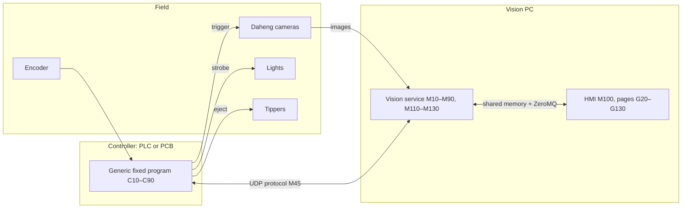

# Vision Sorting Platform — Architecture & Build Order

Version 0.1 · 2026-10-01

---

## 0. Status markers

Every module, page, tab and phase carries one marker.

| Marker | Meaning |
|---|---|
| **[V1]** | Fully implemented in the initial version (shadow mode) |
| **[PARTIAL]** | Partially implemented in V1; completed later |
| **[LATER]** | Not implemented in V1; interface or placeholder only |
| **[REDO]** | Implemented in V1 but will need a complete rework or replacement in the final version |

Markers can be combined, e.g. **[V1][REDO]**.

---

## 10. Scope

### 10.10 Initial version (V1): shadow mode
- An external PLC (not ours) triggers cameras and lights and drives the ejectors. There is **no communication** between the vision PC and that PLC.
- The vision PC receives **camera images only**, from Daheng cameras in hardware-trigger mode.
- V1 does live view, ROI setup, tracking by frame sequence, analytics, grading (shadow decisions), data and stats, and diagnostics on the camera side.
- V1 does **not** actuate anything.

### 10.20 Final version
- Our own controller (PLC or self-built PCB) acts as a **dumb, deterministic executor**. It holds no settings and no logic beyond its fixed generic program.
- The vision PC and GUI own all configuration: IO mapping, trigger, light and eject timing, encoder relations, machine layout, sorting specs.
- Ejection is encoder-position-based with µs-level output accuracy.

### 10.30 Platforms
- **Target:** Ubuntu LTS (24.04), x64. All releases are built, tested and shipped for Ubuntu.
- **Prepared:** Windows 10/11 x64. The code base is kept Windows-ready from day one, so a Windows release only needs the platform layer implementation (M15.20), an installer and on-site testing (P220). No changes to service or HMI logic.

---

## 20. Numbering convention

Numbers step by 10 (sections, modules, phases) so new items slot in without renumbering. Numbers are never reused.

| Item | Format | Example | Insert between |
|---|---|---|---|
| Doc section | multiple of 10 | 80. Tracking | 85 |
| Module | `M` + multiple of 10 | M30 Camera acquisition | M35 |
| Sub-module | module + `.` + multiple of 10 | M30.10 Daheng adapter | M30.15 |
| Controller function | `C` + multiple of 10 | C50 Eject queue | C55 |
| GUI page | `G` + module number | G30 Cameras | G35 |
| GUI tab | page + `.` + multiple of 10 | G30.10 Live view | G30.15 |
| Build phase | `P` + multiple of 10 | P40 Tracking | P45 |
| Message type | `MSG-<module>-<nn>` | MSG-30-01 Frame | sequential per module |

Phase blocks: **P10–P90 = V1**, **P100–P190 = controller and live sorting**, **P200+ = extensions**.

---

## 30. System architecture



In V1 the controller block is the external PLC with **no link** to the PC. Only the camera → service path is used.

### 30.10 Principles
1. **The PC decides, the controller acts.** The PC never fires outputs directly. Timing accuracy comes from controller hardware timers.
2. **The service and the HMI are separate processes.** A GUI crash never stops processing.
3. **Every hardware and OS dependency sits behind an interface:** `ICamera`, `IController`, `ITracker`, `IStorage`, and the platform interfaces of M15.
4. **Capabilities drive the GUI.** Features the active controller can't support are shown read-only or disabled, never removed.
5. **Modules communicate only via the message bus**, never through direct calls.
6. **All configuration lives on the PC**, versioned, and is pushed to the controller on connect and on change.
7. **Portable code only, outside M15.** No POSIX or Win32 calls outside the platform layer. Use `std::filesystem` for paths, no hardcoded system paths, UTF-8 strings, and fixed-size integer types with defined endianness in messages and files.

### 30.20 Tech stack
| Layer | Choice | Status |
|---|---|---|
| Language | C++23 (Python only for offline tools and training) | [V1] |
| Build | CMake presets + vcpkg; CI builds on Ubuntu and Windows | [V1] |
| Compiler | GCC 13 (Ubuntu); MSVC 2022 (Windows, CI only in V1) | [V1] |
| OS | Ubuntu LTS 24.04 (target); Windows 10/11 x64 (prepared) | [V1] / Windows [LATER] |
| GUI | Qt 6 LTS, Qt Quick/QML, GPU texture live view | [V1] |
| IPC | Shared memory (frames) + ZeroMQ (messages) | [V1] |
| Cameras | Daheng Galaxy SDK (C API, GenICam) | [V1] |
| Vision | OpenCV | [V1] |
| Inference | ONNX Runtime / TensorRT | [PARTIAL] |
| Storage | SQLite + image folders | [V1][REDO] → PostgreSQL/TimescaleDB for multi-line |
| Controller link | UDP, binary protocol (M45) | [LATER] |
| Linking | Dynamic: vcpkg `x64-linux-dynamic` / `x64-windows`; required for Qt LGPL | [V1] |
| Packaging | Ubuntu: CPack `.deb` (service + HMI + bundled libs, RPATH `$ORIGIN/../lib`) | [V1] |
| Packaging | Windows: installer (WiX/NSIS), Windows service instead of systemd | [LATER] |

---

## 40. Modules (vision service)

| ID | Module | Responsibility | Interface | Status |
|---|---|---|---|---|
| M10 | Core service | Lifecycle, threads, logging, message bus, watchdog | `IModule`, `MessageBus` | [V1] |
| M15 | Platform layer | All OS-specific code: shared memory, service hosting and stop signals, thread priority/affinity, standard paths (config, data, logs) | `ISharedMemory`, `IServiceHost`, `IThreadTuning`, `IPaths` | [V1] |
| M15.10 | Linux implementation | POSIX shm, systemd, SIGTERM/SIGINT, pthread affinity, `/etc`, `/var/lib` paths | M15 interfaces | [V1] |
| M15.20 | Windows implementation | File mapping, Windows Service, console/service stop, affinity mask, `%ProgramData%` paths | M15 interfaces | [LATER] |
| M20 | Config & recipes | Machine config, recipes, versioning, validation, schema migration | `IConfigStore` | [V1] |
| M30 | Camera acquisition | Discovery, settings, grabbing, frame IDs, timestamps | `ICamera` | [V1] |
| M30.10 | Daheng adapter | Galaxy SDK implementation | `ICamera` | [V1] |
| M30.20 | Replay camera | Plays recorded sets as live | `ICamera` | [V1] |
| M30.30 | Recorder | Raw frames + metadata to disk | — | [V1] |
| M30.40 | Trigger source config | V1: external trigger only. Later: trigger plan from own controller | — | [PARTIAL] |
| M30.50 | Camera manager | Connects the camera adapters to the service: discovery loop, camera map (serial → ID), saved settings, reconnect, frame fan-out | `ICameraBackend`, `ICameraAccess` | [V1] |
| M40 | Controller abstraction | Encoder, triggers, lights, ejects, IO, capability flags | `IController` | [V1] interface |
| M40.10 | Null controller | No capabilities (shadow mode) | `IController` | [V1] |
| M40.20 | Simulated controller | Fake encoder, trigger log, events, eject acks | `IController` | [PARTIAL] |
| M40.30 | Own controller adapter | Implements M45 protocol | `IController` | [LATER] |
| M40.40 | External PLC adapter | Only if a link to a third-party PLC is ever available | `IController` | [LATER] optional |
| M45 | Controller protocol | Message spec shared by PC and controller firmware | spec + lib | [LATER] |
| M50 | Object tracking | Frame → lane, object, photo index | `ITracker` | [V1] |
| M50.10 | Frame-sequence tracker | Counts frames; gap detection; image-based resync | `ITracker` | [V1][REDO] replaced by M50.20 |
| M50.20 | Encoder tracker | Uses trigger log (trigger nr → encoder count) | `ITracker` | [LATER] |
| M60 | Image analytics | Stage pipeline + debug overlays | `IAnalysisStage` | [V1] |
| M60.10 | Basic stages | Preprocess, segmentation, size, dirt % | stage | [V1] |
| M60.20 | Extended stages | Cracks, shape, colour, shell defects | stage | [LATER] |
| M60.30 | ML stages | Model inference (ONNX/TensorRT) | stage | [PARTIAL] |
| M70 | Grading | Sorting specs, rules, grades, decision per object | `IGradingRule` | [V1] (shadow) |
| M70.20 | Grade → outlet mapping | Which grade goes to which tipper/outlet | — | [LATER] |
| M75 | Eject planning | Decision → `{tipper, eject_at_count, pulse}`; deadline check | — | [LATER] |
| M80 | Data & statistics | Results DB, image archive, batch stats, export | `IStorage` | [V1] |
| M80.20 | Retention & archiving | Auto-cleanup, sampling rules | — | [PARTIAL] |
| M80.30 | DB backend migration | PostgreSQL/TimescaleDB behind `IStorage` | `IStorage` | [LATER] |
| M90 | Diagnostics | FPS, drops, latency, queue levels | `IDiagnosticsSource` | [V1] |
| M90.20 | Controller event timeline | Encoder/trigger/light/eject events, scope view | — | [LATER] |
| M100 | HMI shell | QML app, navigation, page plugins, IPC client | `IPage` | [V1] |
| M100.20 | Users & roles | Operator / engineer / admin | — | [PARTIAL] |
| M110 | Lights control | Strobe timing and intensity via controller | — | [LATER] |
| M120 | Calibration | px→mm, encoder↔photo, encoder↔tipper, tipper test | — | [PARTIAL] px→mm only |
| M130 | Machine state | Run/stop/fault, heartbeat, safe-state policy | — | [PARTIAL] service states only |
| M140 | External integration | MES/ERP export, remote support | — | [LATER] optional |

### 40.10 Core messages
| ID | Message | Status |
|---|---|---|
| MSG-10-01 | Heartbeat | [V1] |
| MSG-20-01 | ConfigChanged | [V1] |
| MSG-30-01 | Frame (ID, camera, timestamp, buffer ref) | [V1] |
| MSG-30-02 | CameraListChanged (event, no payload) | [V1] |
| MSG-30-03 | CameraRates: per camera with a sensor, frames in and frames analysed per second (about 1 Hz, from the analysis module; topic `cam`) | [V1] |
| MSG-50-01 | ObjectRecord (V1: lane, cup ID, sensor, photo or NO_DATA; one record per sensor and cup) | [V1][REDO] becomes one record per object with all photos and the encoder position |
| MSG-50-02 | CupUpdate: the changed cups of one lane (cup ID, per sensor Pending/Ok/NoData + measurements) with seq; GetCupSnapshot gives the last 50 cups per lane (section 40.50) | [V1] |
| MSG-60-01 | Measurement | [V1] |
| MSG-70-01 | Decision | [V1] |
| MSG-75-01 | EjectCommand | [LATER] |
| MSG-90-01 | DiagEvent | [V1] |
| MSG-90-02 | ControllerEvent | [LATER] |


### 40.20 Camera wiring (M30.50, P30.85)

The camera module connects the camera adapters (M30.10, M30.20) to the rest of the service. It lives in `service/src/camera/`.

| Part | Responsibility |
|---|---|
| `ICameraBackend` | Discovery plus a factory for closed cameras. `DahengBackend` (only built with `VSORT_WITH_GALAXY`) and `ReplayBackend` (plays a recorded session). |
| `CameraManager` | One slot per logical camera ID: camera map, saved settings, connect and reconnect, frame fan-out. Thread-safe. |
| Supervisor thread | Every 2 s: discovers cameras, then opens, configures and starts every mapped camera that is not connected. A missing camera is never fatal. Discovery only runs while something is missing. |
| `ManagerCameraAccess` | `ICameraAccess` adapter (list, settings, apply) handed to the IPC server. |
| `CameraModule` | `IModule` "camera", depends on "ipc". Starts and stops the manager. Health is Degraded while a mapped camera is not streaming. |

```
grab thread → frame callback (sets meta.cameraIndex = logical ID) → frame sinks → PreviewHub::submit()
HMI → IPC server → ManagerCameraAccess → CameraManager → ResilientCamera → adapter
```

Rules:

- **Frame sinks.** More consumers (tracking, recorder) are added as sinks in the same way. This is a direct callback and deviates from principle 5 (see section 110).
- **Camera map** (`camera_map`). If it is empty, the cameras found are numbered 0..n-1 by serial number and saved. If it has entries, only mapped cameras are used. Others are logged once and ignored. Configured cameras that are not found are listed as Closed.
- **Saved settings** (`camera_settings`, per logical ID, not per serial, because they belong to the lane position). They are applied on every (re)open and saved after the camera accepted an apply. The default trigger is hardware (V1: external PLC).
- **Bench option `--free-run`.** It forces free-run at open and is never saved.
- **Replay** (`--replay <session>`). It uses a fixed map from the recorded indices and neither reads nor writes `camera_map` or `camera_settings`.
- **Record tool** (`vsort_record --root <dir>`, P20.95). It loads `camera_settings` of that service root and applies them per logical camera ID (exposure, gain, trigger, edge, ROI); `--exposure-us`, `--gain-db` and `--trigger` override them for all cameras. A camera without saved settings, or with a software trigger, stops the tool before a session is created. The service must be stopped (a camera opens in one process only). Shortcuts: serials are still given with `--camera <id>=<serial>` (`camera_map` is not read); the applied settings are stored only as text in the session label, not as fields of `session.json`; if `camera_settings` does not exist yet, the config store creates it with its defaults (no cameras).
- **Change events.** Changes of the camera list or of a camera state are announced with the event `CameraListChanged` (MSG-30-02). The HMI then fetches the list again.
- **Frame rates** (P30.86). The live view shows per camera the frames that came in and the frames analysed without error (MSG-30-03), measured in the service over about 1 s. The preview is a downscaled copy limited to 15 fps by default and is not used for the rates. Shortcuts: rates come from the analysis module, so a camera without a sensor, or any camera while the analysis is disabled, shows "–"; the shown size is that of the preview, not of the camera.
- **Open limits.** The camera map is read once at start (editing it at runtime comes with G20.20). The HMI settings page does not edit trigger mode yet.

### 40.30 Machine model (M20, P50.10)

Config module `machine` (`common/include/vsort/common/machine_config.hpp`). V1 edits it by hand as JSON; the GUI editors come with P50.40/P50.50.

```
lines[]: id, name, lanes[]
  lanes[]: id, name, sensors[]            (sensors upstream first)
    sensors[]: id, name, kind ("camera"), camera_id, roi_id, offset_cups,
               show_in_monitor, measurements[]: key, label, unit, format
```

- **IDs.** Line, lane and sensor IDs are 1..65535 and unique in the whole machine, so a lane ID alone identifies a lane in IPC messages and in the Product Monitor.
- **Cameras.** `camera_id` is the logical ID from `camera_map`. One camera may serve several lanes (one ROI per lane), but appears only once per lane.
- **Offsets.** Lane cup ID = sensor cup counter − `offset_cups`. Sensors are listed upstream first and `offset_cups` never decreases along the lane; "most upstream" means first in the list.
- **Lane ROI.** `roi_id` is a ROI of that camera in `rois`; 0 means the whole image. A ROI that does not exist is a warning at start, not an error.
- **Measurements.** `key` uses a-z, 0-9, '_' and is unique per sensor; `label` is the column header; `unit` may be empty. An empty catalog means the sensor only has its photo column.
- **show_in_monitor.** false hides the sensor's columns in G140.10.
- **Validation.** The store checks the schema; `MachineConfig::fromJson` checks the basic rules above and reports every violation. The service does not start with an invalid machine config. Further rules come with P50.20.
- **Defaults.** One line, one lane, four camera sensors (camera 0..3, offset 0, whole image, visible, no measurements).
- **Hand edits.** Stop the service, edit `data` in `<config dir>/machine.json`, start it again. A hand edit does not create a history version. `SetConfig` over IPC does, but checks only the schema; P50.20 adds a rule check in the store before a GUI editor uses it.

### 40.40 Tracking (M50.10, P40.10–P40.30)

Lives in `service/src/tracking/`.

```
grab thread → frame sink → TrackingModule::submit() → FrameInbox (metadata only, 256, drop + count)
tracking thread → FrameSequenceTracker::onFrame() → ObjectRecord (MSG-50-01) → MessageBus
```

| Part | Responsibility |
|---|---|
| `ITracker` | `onFrame` (every frame, one thread), `onTick` (10 Hz, for P40.40), `counters`. M50.20 (encoder) implements the same interface later. |
| `FrameSequenceTracker` | M50.10: one frame = one cup per camera (hardware trigger). Per sensor a cup counter from 0 at tracking start; lane cup ID = counter − offset (negative: the cup passed sensor 1 before tracking started). Frame-ID gaps ≤ 100 (frames lost after exposure) become NoData cups; a larger jump or a restarted frame ID counts as an ID reset. |
| Lane crop (P40.20) | Lane ROI (fractions) → pixel rectangle per frame, clamped to the image; Bayer crops on even pixels. `cropFrame()` gives a zero-copy view that keeps the frame's owner. |
| `TrackingModule` | `IModule` "tracking", depends on "camera". Own thread; publishes the records on the bus; logs the counters every 10 s when they changed. Degraded for 10 s after an inbox drop. A dropped frame shows up as a frame-ID gap, so it becomes a NoData cup. |

V1 shortcuts (compared to the final implementation):
- **One record per sensor and cup.** ObjectRecord is one sensor's observation; P80.100 assembles the cup from the records with the same lane and cup ID. Final: one object record with all photos and the encoder position (P130).
- **No pixels in the record.** Only camera, frame ID, timestamps and crop rectangle. The inbox holds metadata only, so tracking never holds camera buffers. How P60 gets the pixels (frames buffered per camera by frame ID, or frames with a bounded lifetime in the inbox) is decided in P60.10.
- **Counting and misses.** See section 40.45 (P40.40).
- **Read once.** Tracking reads `machine`, `rois` and `tracking` at start; restart the service after editing them.
- **Queue and intervals in code.** Queue size (256), tick (100 ms) and log interval (10 s) are code defaults; all thresholds are in the `tracking` config module.
- **Only with cameras.** The module is only added when a camera source is configured (Daheng or replay).
- **Not on IPC.** ObjectRecord is in `vdk_ipc.fbs` (msg type 5001) but not published; the HMI gets cup updates via MSG-50-02 (P80.100).
- **Rectangular crops only.** No rotation or perspective correction per lane.

### 40.45 Miss detection and speed handling (M50.10, P40.40)

V1 machine: 10 cups/s nominal, start and stop ramps of 1–5 s, emergency stop possible, every camera has its own trigger, no signal from the machine.

```
frame → CameraTiming (per camera, own clock) → decisions: Ok, misses before it, extra, or held
      → per sensor of that camera: LaneConsistency → cup index (+ correction) → ObjectRecords
```

| Part | Rule |
|---|---|
| Camera timing | Own clock: device timestamp (ns), host time if the camera has none. Intervals are never compared between cameras. Prediction: straight-line fit over the last 8 single-cup intervals, so ramps are followed. States per camera: Silent → Starting → Running; Silent after max(1 s, 5 × interval) without frames. |
| Missed triggers | Running only. Interval ≥ 1.5 × prediction → k = round(interval / prediction) cups. Accepted only if the NEXT interval matches the prediction within 30 % (speed unchanged); otherwise it was a pause: nothing inserted, back to Starting. More than 5 suspected misses = a stop. The frame is held until the next frame or the stop timeout. |
| Double triggers | Running only: interval < 0.5 × prediction → frame dropped and counted. |
| Starting | After a stop or a reconnect: one cup per frame, no insertion, until 4 intervals fit a straight line within 20 %. The interval spanning a stop is not used. |
| Cross-sensor check | Steady cameras only (last intervals within 10 % of their mean), so it pauses during ramps. Each sensor's count at the same host moment (extrapolated with its interval) minus its learned phase. Majority vote; a tie goes to the most upstream sensor. Off by a whole cup twice in a row → counter corrected, and that sensor's cups since its last agreement (max 50) become NoData. Off by a non-whole amount 10 times in a row → phase re-learned. |
| Phase convention | The first steady sensor anchors the lane. Every other sensor gets a phase within ±0.5 cup of it; the whole-cup part is corrected (camera started in another machine step). Phases are saved in `<data dir>/tracking_state.json` every 10 s and at stop, and reused at start, so the cup numbering is the same after a service restart. A saved phase that no longer fits is ignored and re-learned. Sensor offsets (machine config) are calibrated against this numbering. |
| Corrections | A later ObjectRecord for the same lane, cup and sensor replaces the earlier one; P80.100 must upsert. |
| Config | Module `tracking`: 17 thresholds, all relative to measured intervals, none per speed. Defaults as above. |

V1 shortcuts (compared to the final implementation):
- **Simultaneous errors.** Two sensors failing undetected at the same moment (2 vs 2) can make the check correct the wrong pair. Stress test: no errors at a 0.2 % miss rate, 5 of 1200 runs at 1 %.
- **Misses during ramps** are found only when the speed is steady again; up to 50 cups of that sensor are then marked NoData.
- **Start-up.** The first cups of a sensor that needs alignment at start become NoData.
- **Without `tracking_state.json`** a sensor whose phase is about half a cup from the anchor can be numbered one cup differently than in an earlier run.
- **Latency.** USB/GigE latency is part of the learned phase; it drifts with speed and is followed only at steady speed.
- **Single-sensor lanes** get timing-based detection only.
- **P40.70 (replay test with dropped frames)** stays open until a 4-camera recording with a start and a stop exists; synthetic tests cover the logic.

### 40.50 Product Monitor data (M80, P80.100)

```
tracking → ObjectRecord (bus) → module "cups": CupTable, ≤ 10 Hz → CupUpdate (bus) → IpcServer → topic "cups"
HMI connects → GetCupSnapshot → CupMonitor::snapshot()
```

- **Rows.** Per lane the last 50 cups by lane cup ID, continuous: missing IDs are created as rows. Records older than the window are ignored.
- **Cells.** One per sensor of the lane, upstream first: Pending (not reached yet), Ok, NoData. A later record for the same lane, cup and sensor replaces the earlier one (P40.40 corrections).
- **Passed without photo.** Cup c is due at sensor s when the newest cup ID passes c + (offset_s − smallest offset); still Pending 3 cups after that → NoData. Covers a silent camera and lost records. Nothing changes while the machine stands still.
- **Updates.** At most 10 per second per lane; only changed cups, full state per cup, newest first; seq + 1 per update.
- **Snapshot.** `GetCupSnapshot(lane_id; 0 = all)` returns per lane the cups (newest first), the depth and the seq they include. The HMI subscribes first, asks the snapshot, and ignores updates with seq ≤ that seq. Updates carry full state, so a duplicate is harmless.
- **Columns.** The service sends every sensor; the HMI picks the columns (show_in_monitor, measurement catalog) from the `machine` config via GetConfig.
- **Always on.** Module "cups" also runs without cameras (empty table); Hello lists the capability `cups`. The log shows a summary per lane every 10 s when it changed.

V1 shortcuts (compared to the final implementation):
- **In memory only.** The table is empty after a service restart; history comes with the results database (P80.10).
- **Measurements** (P60.15) come from MSG-60-01 and belong to the photo of the cell: a measurement of another frame is ignored, a new photo or NoData clears them.
- **Read once.** The machine config is read at start; restart after editing it.
- **Code defaults.** The pass margin (3 cups), depth (50) and update interval (100 ms) are not configurable yet.

### 40.55 Product Monitor page (G140.10, P80.110)

Page plugin `hmi/pages/product_monitor` (pageId G140, order 140); model `ProductMonitorModel` in `hmi/src/live` (QML context property `productMonitor`).

- **Lanes and columns.** From the `machine` config (GetConfig on connect): lane dropdown; per sensor with `show_in_monitor` a photo column (sensor name) and one column per measurement ("label [unit]"). The first column is the lane cup ID.
- **Cells.** Photo: "photo OK" (green), red "no data", empty while the cup has not reached the sensor. Measurements (P60.15): the value in the catalog `format` (`number` 1 decimal, `integer`, `presence` = "present"/"empty"); "–" while there is no value (no photo, no data, not measured yet).
- **Rows.** Compact (`Theme.tableRowHeight`, 28 px), so more cups fit on the screen. A cup with product (presence column "present") gets a lighter row (`Theme.rowFilled`); empty and not yet measured cups keep the dark rows.
- **Rows.** Newest cup on top, up to the depth the service reports (50). Updated in place (insert at the top, remove at the bottom), so the view keeps its delegates.
- **Sync.** On connect: GetConfig("machine") and GetCupSnapshot(all lanes). Updates with seq ≤ the lane's seq are dropped; before the first snapshot or after a gap in seq a new snapshot is requested (one in flight, retried after 1 s).
- **Freeze.** Bottom-right button Freeze / Back to live. Frozen: the table holds still while data keeps arriving; back to live shows the current state. Choosing another lane goes back to live.
- **States.** "Service offline", "Loading the machine config…", "Machine config invalid: …", "No lanes in the machine config" and "No cups yet" replace the table.
- **Tests.** Model tests against FakeService (`vsort_hmi_live_tests`, also on Windows); offscreen GUI test of the real page (`vsort_hmi_gui_tests`, Linux).

V1 shortcuts (compared to the final implementation):
- **Read on connect.** The machine config is read when the HMI connects; after editing it, restart the service (the HMI reconnects and reads it again).
- **Display only.** No row selection, cup details, photos or export; no column order or width settings.
- **Freeze per lane.** Switching lanes leaves the frozen view.
- **No history.** Only the last 50 cups the service keeps; nothing from before a service restart.

### 40.60 Analysis (M60, P60.10)

Lives in `service/src/analysis/`.
grab thread → frame sink → AnalysisModule::submit() → queue per camera (4 frames, drop + count)
camera thread → per sensor of that camera: lane ROI + buffer → preprocess → segmentation → size
join thread: result + ObjectRecord (same sensor and frame ID) → Measurement (MSG-60-01) → bus

| Part | Rule |
|---|---|
| Pixel access (open point of 40.40) | Frames are analysed on arrival, before tracking knows the cup; the buffer is released when the pipeline is done. Results (64 per sensor) wait for the ObjectRecord with the same sensor and frame ID; a record waits 2 s for its result. A corrected record for the same frame gives a new Measurement. |
| Stages | `IAnalysisStage`, timed per stage. Preprocess: Mono, Bayer RG, RGB, BGR → BGR. Segmentation (eqraftvision cups mode): HSV range, erode/dilate, fill enclosed holes, filter on area, diameter, hull area, aspect ratio, solidity; an object counts when its hull centre is inside the lane ROI (detection runs in ROI + buffer). Size: orientation from moments, length/width from the hull, largest object. |
| Keys | `count`, `present` (1 when count ≥ 1, else 0), `mask_pct`; `length_mm`, `width_mm`, `area_mm2` only when count ≥ 1. |
| Config | Module `analysis`: defaults plus overrides per sensor ID, `enabled`, debug images (`debug_every_n`, `debug_max_images`) in `<data dir>/analysis_debug/sensor_<id>/`. Defaults are the eqraftvision values of the potato test set-up. |
| Log | Per sensor every 10 s: frames, ms per stage, failures. Join totals when they change. |

V1 shortcuts (compared to the final implementation):
- **mm/px quick fix.** `roi_width_mm` / lane ROI width, only valid while the lane ROI is exactly one cup (200 mm). Replaced by G30.40 calibration (P60.50).
- **White balance** is not in the camera settings; the default HSV range assumes R 1.2 / G 0.9 / B 2.0 set in the camera.
- **Read once.** Restart the service after editing `machine` or `rois`. A saved `analysis` config is applied from the next frame (P60.45); only `enabled` needs a restart.
- **Fixed stage list** until the recipe (P60.20).
- **Last value only.** The cup table keeps the measurements of the last 50 cups; history comes with the results database (P80.10).
- **No production statistics** (own branch with a dashboard later).
---


## 50. Controller (own PLC/PCB): final version only

Fixed generic program, written once. No machine-specific settings stored; everything is received from the PC. All items are **[LATER]**.

| ID | Function | Detail |
|---|---|---|
| C10 | Encoder counting | Hardware counter; position streamed to PC (≤1 kHz) |
| C20 | Camera triggers | Fire at positions/intervals from the PC's trigger plan |
| C30 | Trigger log | Trigger nr → encoder count, sent to PC |
| C40 | Light strobes | Timed with triggers, pulse width from PC |
| C50 | Eject queue | Per tipper, position-sorted; fire at `eject_at_count` for `pulse` µs |
| C60 | IO mapping table | Logical function → physical channel, received from PC |
| C70 | Watchdog & safe state | PC heartbeat lost → safe-state action set by PC |
| C80 | Event stream | Timestamped events (encoder, triggers, lights, ejects, inputs, late commands) |
| C90 | Protocol handler | M45 over UDP: sequence nrs, acks, versioning |

The emergency stop is a hardwired safety circuit, independent of PC and controller.

### 50.10 Controller protocol (M45) message set [LATER]
`Hello/Version` · `ConfigPush` (IO map, timings) · `TriggerPlan` · `EjectBatch` · `Heartbeat` · `EncoderStatus` · `TriggerLog` · `EventStream` · `Ack/Nack` · `Fault`

---

## 60. GUI pages

Each page is a QML plugin with tabs. Visibility depends on controller capabilities and user role.

| Page | Tabs | Status |
|---|---|---|
| **G20 Machine** | G20.10 Lines & lanes [V1] · G20.20 Sensor config [V1] (sensor → lane, kind, offset in cups, measurements, "show in Product Monitor") · G20.25 Machine config [V1] (lanes, sensors per lane, offsets) · G20.30 Tippers [PARTIAL] logical only · G20.40 Recipes [V1] | [V1] |
| **G30 Cameras** | G30.10 Live view, all cameras, freeze/unfreeze [V1] · G30.20 ROI [V1] · G30.30 Exposure/gain [V1] · G30.40 Calibration px→mm [V1] · G30.50 Record/replay [V1] | [V1] |
| **G40 Controller** | G40.10 Status [PARTIAL] "no controller" · G40.20 IO mapping [LATER] · G40.30 Connection/firmware [LATER] | [PARTIAL] |
| **G50 Tracking** | G50.10 Photos per object: not needed (V1 hardware trigger, one frame per cup) · G50.20 Pitch in frames: not needed · G50.30 Lane ROIs [V1] (V1: `roi_id` in the machine config, edited by hand) · G50.40 Resync [LATER] | [PARTIAL] |
| **G60 Analytics** | G60.10 Pipeline stages [V1] · G60.20 Parameters [V1] · G60.30 Debug overlays [V1] · G60.40 Models [PARTIAL] | [V1] |
| **G70 Sorting specs** | G70.10 Grades [V1] · G70.20 Rules (size, dirt %, …) [V1] · G70.30 Shadow decisions [V1] · G70.40 Grade → outlet [LATER] | [V1] |
| **G80 Production** | G80.10 Live batch stats [V1] · G80.20 History [V1] · G80.30 Image browser [V1] · G80.40 Export [PARTIAL] | [V1] |
| **G90 Diagnostics** | G90.10 Camera FPS/drops [V1] · G90.20 Latency/queues [V1] · G90.30 Event timeline/scope [LATER] | [PARTIAL] |
| **G100 System** | G100.10 Users & roles [PARTIAL] · G100.20 Logs [V1] · G100.30 Version/update [V1] | [V1] |
| **G110 Lights** | G110.10 Strobe timing [LATER] · G110.20 Intensity [LATER] | [LATER] |
| **G120 Timing & calibration** | G120.10 Encoder ↔ photo [LATER] · G120.20 Encoder ↔ roller ↔ tipper [LATER] · G120.30 Tipper test/jog [LATER] | [LATER] |
| **G130 Machine state** | G130.10 Run/stop/fault [PARTIAL] · G130.20 Safe-state policy [LATER] | [PARTIAL] |
| **G140 Product monitor** | G140.10 Live cup table per lane [V1] [DONE P80.110] (lane dropdown, last 50 cups, newest on top, columns from Sensor config, red "no data" cells, freeze / back-to-live button bottom corner) · G140.20 Offset calibration [V1] (step one cup through an empty machine, read the offset per sensor) | [V1] |

---

## 70. Tracking & timing

| Aspect | V1 (frame-sequence) | Final (encoder) | Status |
|---|---|---|---|
| Object identity | Per-sensor frame count: one frame per cup per camera (hardware trigger) | Trigger log → encoder count → cup/roller index | [REDO] |
| Photo timing | Set in external PLC (not ours) | Trigger plan from GUI (G120.10) | [LATER] |
| Lane assignment | Fixed ROI per lane | Same | [V1] |
| Frame loss | Frame-ID gaps (exact, P40.30) and missed triggers (timing + cross-sensor check, P40.40) → NoData cups | Gap detection + exact recovery via trigger log | [V1][REDO] |
| Resync | Cross-sensor consistency check (P40.40); image-based resync deferred (P40.50) | Encoder reference; image-based as check | [V1][REDO] |
| Eject timing | — | `eject_at_count` = object count + offset + mechanical delay (G120.20) | [LATER] |
| Late decision | — | Controller applies default action and logs it | [LATER] |
| Cup creation | Per-sensor cup counter, aligned and repaired by the cross-sensor check (P40.40) | Encoder signal creates the cup; all sensor positions derive from it | [V1][REDO] |
| Sensor offset | Integer cups from the reference sensor, per sensor | Encoder counts, per sensor | [V1][REDO] |
| Missing data | Cup stays in the table, cell red "no data" | Same | [V1] |

**Assumptions for V1:**
- Each camera gets one hardware trigger per cup and delivers one frame per trigger. A missed trigger gives no frame and does not advance the frame ID.
- The frame ID only jumps for frames lost after exposure (transport); those are counted exactly.
- Lanes are separated by fixed ROIs.
- No machine-state signal and no encoder: speed changes, stops and starts are detected from frame timing (P40.40).

---

## 80. Data model

| Entity | Key fields | Status |
|---|---|---|
| Batch | ID, recipe version, start/stop, operator | [V1] |
| Object | ID, batch, lane, seq nr, encoder pos | [V1][REDO] encoder pos added |
| Photo | object, camera, frame ID, timestamp, file ref | [V1] |
| Sensor | ID, lane, kind (camera, weight, …), offset, measurement list, visible flags | [V1] |
| Measurement | object, sensor, key, value or NO_DATA | [V1] |
| Decision | object, grade, rule hits, shadow/live flag | [V1] |
| EjectRecord | object, tipper, planned count, fired/late | [LATER] |
| Event | source, type, timestamp, payload | [PARTIAL] |
| ConfigVersion | config/recipe snapshot, author, time | [V1] |

Images are stored on disk (rejects plus samples), with paths in the database.

---

## 90. Reliability

| Item | Status |
|---|---|
| Service runs as system service with auto-restart | [V1] |
| HMI crash-isolated from service | [V1] |
| Internal watchdog per module | [V1] |
| Config versioning + rollback | [V1] |
| Controller heartbeat + safe state | [LATER] |
| Shadow vs live comparison mode | [LATER] |
| 24 h soak test per release | [V1] |

---

## 100. Build order

Task IDs follow the numbering rule (steps of 10, e.g. P10.10, P10.20) so tasks can be inserted later (P10.15). Every task has the phase's status unless marked otherwise. Each phase ends with its **Done when** check.

### V1: shadow mode (P10–P90) [V1]

#### P10 Foundations (M10, M20)
- **P10.10 [DONE]** Create the Git repo as a mono-repo: `/service`, `/hmi`, `/common`, `/tools`, `/firmware` (empty), `/docs`. Add branching strategy, `.gitignore`, `.clang-format` and `.clang-tidy`.
- **P10.20 [DONE]** Set up a CMake superbuild with presets (debug, release) for Linux and Windows, and a vcpkg manifest for Qt 6, OpenCV, cppzmq, spdlog, nlohmann-json, SQLite and GoogleTest.
- **P10.30 [DONE]** Set up the CI pipeline: build and unit tests on Ubuntu and Windows, clang-tidy on Ubuntu, and store build artifacts. A broken Windows build blocks the merge.
- **P10.40 [DONE]** Build the common library: base types (Timestamp, FrameId, ObjectId), error handling (`std::expected`), and logging (spdlog, rotating files). Includes little-endian helpers and the CI portability check (`tools/check_portability.sh`).
- **P10.45 [DONE]** Build the platform layer (M15): interfaces plus the Linux implementation (M15.10). On Windows, stubs that compile and return "not supported", so CI stays green. Lives in `common/platform/` as the separate library `vsort::platform`.
- **P10.50 [DONE]** Build the message bus: typed publish/subscribe, bounded lock-free queues, drop counters.
- **P10.60 [DONE]** Build the module framework: `IModule` (init/start/stop/health), module registry, startup and shutdown order.
- **P10.70 [DONE]** Build the service executable: CLI arguments, stop signals via `IServiceHost` (M15), graceful shutdown.
- **P10.80 [DONE]** Build the config store: JSON schema per module, load/validate/save, versioning (ConfigVersion), and the MSG-20-01 change notification.
- **P10.90 [DONE]** Set up unit tests for the bus and config store, and add them to CI.
- **P10.95** Clean up the warnings, disable the intentional checks in .clang-tidy, then set WarningsAsErrors: '*'

**Done when:** the service starts and stops cleanly, loads and validates config, and CI is green.

#### P20 Acquisition (M30)
- **P20.10 [DONE]** Define the `ICamera` interface: open/close, settings (exposure, gain, ROI, trigger mode), start/stop, frame callback, frame metadata.
- **P20.20 [DONE]** Build a frame buffer pool: preallocated and ref-counted, so frames can later go to shared memory without copying.
- **P20.30 [DONE]** Build the Daheng adapter (M30.10): discovery (USB3 and GigE), open by serial number, hardware trigger on Line0, frame ID and timestamp from the SDK.
- **P20.35 [DONE]** Build "Detect cameras" and GigE IP setup in the app (replaces AutoIPConfigTool): list cameras, flag those outside the NIC subnet, set the IP by MAC address.
- **P20.36 ** "Detect cameras" in the app, plus setting the GigE IP from the app. This replaces AutoIPConfigTool by calling the same SDK function, so no external tool is needed.
- **P20.40 [DONE]** Tune GigE: jumbo frames, packet delay, NIC receive buffers. Write the Ubuntu PC setup checklist.
- **P20.50 [DONE]** Add camera health handling: auto-reconnect, error counters, frame-ID gap detection.
- **P20.60 [DONE]** Build the recorder (M30.30): raw frames plus metadata, one folder per session.
- **P20.70 [DONE]** Build the replay camera (M30.20): plays recordings through `ICamera` at original or adjustable rate, with loop support.
- **P20.80 [DONE]** Add camera mapping in config: serial number → logical camera ID.
- **P20.90 [DONE]** Build a CLI record tool and record initial datasets on the existing machine.
- **P20.95 [PARTIALLY_DONE]** Record tool applies the saved camera settings per camera (`--root`, section 40.20).

**Done when:** all cameras grab on the external trigger without drops at target rate, and datasets are recorded.

#### P30 HMI shell + live view (M100, G30)
- **P30.10 [DONE]** Design the IPC: a shared-memory ring buffer per camera for preview frames (via `ISharedMemory`, M15), ZeroMQ for commands and events, and a serialization format (FlatBuffers or Protobuf).
- **P30.20 [DONE]** Build the service-side IPC server: preview downscaler (configurable fps and resolution) and command handler.
- **P30.30 [DONE]** Build the HMI skeleton: Qt Quick app, navigation bar, `IPage` plugin loader.
- **P30.40 [DONE]** Build the design system: colours, typography, standard QML components (buttons, numeric inputs, tables, dialogs).
- **P30.50 [DONE]** Build the video item: a custom `QQuickItem` that renders frames as GPU textures.
- **P30.60 [DONE]** Build G30.10 Live view: grid of all cameras, single-camera fullscreen, freeze/unfreeze per camera and for all cameras.
- **P30.70 [DONE]** Build the overlay layer: ROIs, lane lines and detections drawn over the video.
- **P30.80 [DONE]** Build G30.20 ROI editor and G30.30 camera settings: draw, move and resize ROIs, numeric entry, save to config.
- **P30.85 [DONE]** Wire cameras into the service (M30.50): camera manager with discovery loop, camera map, saved settings, frame fan-out to the preview hub, `CameraListChanged` event, service options for Daheng and replay.
- **P30.86 [DONE]** Live view shows the real frame rates (in and analysed, MSG-30-03) instead of the preview rate; preview default 15 fps.
- **P30.90** Add connection handling: HMI auto-reconnect and a "service offline" state.

**Done when:** live view of all cameras is smooth, and a GUI crash or restart does not affect the service.

#### P40 Object tracking (M50.10, G50) [V1][REDO]
- **P40.10 [PARTIALLY_DONE]** Define the `ITracker` interface and the ObjectRecord message (MSG-50-01), see section 40.40.
- **P40.20 [PARTIALLY_DONE]** Split lane ROIs: frame → per-lane crop rectangle and zero-copy view (one lane in V1).
- **P40.30 [PARTIALLY_DONE]** Build the frame-sequence tracker as module "tracking". The V1 hardware trigger gives one frame per cup per camera, so a per-sensor cup counter replaces "photos per object / pitch". Frame-ID gaps become NoData cups.
- **P40.40 [PARTIALLY_DONE]** Add miss detection and speed handling (section 40.45): per-camera timing on its own clock with confirmation by the next interval, double-trigger filter, cross-sensor check with majority vote and counter repair, phases kept across restarts, `tracking` config module. Tests with synthetic trigger sequences (ramps, emergency stop, misses, jitter, outages).
- **P40.50 [LATER]** Add image-based resync: detect the cup or roller edge and correct the phase. Deferred: the cross-sensor check of P40.40 covers V1.
- **P40.60 [LATER]** Build the G50 Tracking page: settings plus a live overlay of object IDs on the images. Deferred until after the first Product Monitor release.
- **P40.70** Test with replay datasets, including artificially dropped frames. Open: needs a recording of all 4 cameras on hardware trigger with a start and a stop (open point 8).

**Done when:** replayed sets map to the correct objects and dropped frames are flagged.

#### P50 Machine configuration (M20, G20) [PARTIAL]
- **P50.10 [PARTIALLY_DONE]** Define the machine model schema (config module `machine`, section 40.30): lines → lanes → sensors. Per sensor: camera, lane ROI, offset in cups, measurement catalog (key, label, unit), "show in Product Monitor" flag. V1 config: one lane with 4 camera sensors. Other sensor kinds (`ISensor`) and tippers are added to the schema later (P50.60); analysis stages (P60) fill the measurement catalog.
- **P50.20** Add validation rules: unique IDs, every lane has a camera, no orphan ROIs.
- **P50.30** Define the recipe model (sorting specs + analytics + tracking parameters), versioned.
- **P50.40** Build the G20.10 lines and lanes editor.
- **P50.50** Build G20.20 Sensor config and G20.25 Machine config. ROI editor (G30.20) uses lane + sensor dropdowns.
- **P50.60** Build G20.30 Tippers: logical list only, no timing. [PARTIAL]
- **P50.70** Build the G20.40 recipe manager: create, copy, activate, compare versions, roll back.
- **P50.80** Add config import/export to file, for backup.

**Done when:** the full machine is described in the GUI and every change is versioned.

#### P60 Analytics (M60, G60)
- **P60.10 [PARTIALLY_DONE]** Define `IAnalysisStage` and the pipeline runner (one thread per camera, timing per stage); module `analysis`, MSG-60-01, join with ObjectRecords (section 40.60).
- **P60.15 [PARTIALLY_DONE]** Measurements into the cup table, IPC (`CupCell.measurements`) and the G140.10 columns; catalog `format` (number, integer, presence); compact table rows.
- **P60.20** Store the pipeline definition in the recipe: ordered stages plus parameters.
- **P60.30 [PARTIALLY_DONE]** Build the preprocessing stage: colour conversion (done), illumination normalisation.
- **P60.40 [PARTIALLY_DONE]** Build the segmentation stage: object mask per lane ROI (eqraftvision cups mode, HSV range).
- **P60.45 [PARTIALLY_DONE]** HSV sliders with live mask preview in G60.20 Parameters (first part of the G60 page; P60.90 completes it); the service reloads `analysis` on ConfigChanged without a restart. Page "Analytics", tab "Parameters": per channel (H, S, V) the channel as grey with the pixels in its range 50 % green, beside it a histogram and a range slider; fourth picture the result (colour, green = in all three ranges); camera dropdown, Freeze/Unfreeze and the camera's ROIs (on/off). The range is saved per camera (an override for every sensor of that camera). Camera selection on G30.20/G30.30/G60.20 is one dropdown (`VsCameraPicker`); G30.20 also has Freeze/Unfreeze.
- **P60.50** Build G30.40 calibration: px→mm from a calibration target, scale per camera.
- **P60.60 [PARTIALLY_DONE]** Build the size stage: area, major/minor axis in mm (mm/px via the `roi_width_mm` quick fix until P60.50).
- **P60.70** Build the dirt % stage: dirt pixel ratio on the shell mask.
- **P60.80** Add multi-photo aggregation: combine measurements per object (max, mean, worst-case rules).
- **P60.90** Build the G60 pages: stage list, parameters with live preview, debug overlay per stage.
- **P60.95** Build the ONNX Runtime stage skeleton for future ML models. [PARTIAL]

**Done when:** measurements appear per object, stages can be swapped, and latency is within budget.

#### P70 Grading (M70, G70)
- **P70.10** Define the grade model: grades/classes with priority order.
- **P70.20** Build the rule engine: conditions on measurements (ranges, thresholds, AND/OR).
- **P70.30** Produce a decision per object (MSG-70-01) with rule hits, including "untracked" handling.
- **P70.40** Build the G70.10 grades editor and G70.20 rules editor.
- **P70.50** Build G70.30 Shadow decisions: live list with image and grade per object.
- **P70.60** Build a validation tool: decisions vs manual labels (confusion matrix).

**Done when:** every object gets a grade, and accuracy against manual checks is measured.

#### P80 Data & statistics (M80, G80)
- **P80.10** Define `IStorage` and the SQLite implementation (schema per section 80).
- **P80.20** Build an async batched writer that never blocks the pipeline.
- **P80.30** Build the image archive: rejects plus sampling rule, folder structure, file references in the database.
- **P80.40** Add batch management: start/stop a batch, linked to the recipe version.
- **P80.50** Add statistics aggregation: counts per grade, lane and time window.
- **P80.60** Build G80.10 Live batch stats and G80.20 History.
- **P80.70** Build the G80.30 image browser: filter by batch, grade or lane, with measurements.
- **P80.80** Add CSV export. [PARTIAL]
- **P80.90** Add a disk-space guard and basic cleanup. [PARTIAL]
- **P80.100 [PARTIALLY_DONE]** Service: per-lane cup buffer (last 50), lane cup ID = sensor count − sensor offset, publish MSG-50-02 on topic `cups`, GetCupSnapshot for the HMI (section 40.50).
- **P80.110 [PARTIALLY_DONE]** Build G140.10 Product monitor: dynamic columns from Sensor config, red "no data" cells, freeze / back-to-live button (section 40.55).
- **P80.120** Build G140.20 offset calibration (move one cup through an empty machine, set offsets).

**Done when:** a batch report and history are generated from stored data.

#### P90 Diagnostics & hardening (M90, M100.20, M130, G90, G100, G130) [PARTIAL]
- **P90.10** Define `IDiagnosticsSource`; collect metrics for fps, drops, queue levels and latency per stage.
- **P90.20** Build G90.10 and G90.20: live graphs of the metrics.
- **P90.30** Add service machine states (idle/running/fault) and G130.10. [PARTIAL]
- **P90.40** Add basic users and roles (operator, engineer, admin) in G100.10. [PARTIAL]
- **P90.50** Build G100.20 log viewer and G100.30 version info.
- **P90.60** Run as a systemd service with auto-restart (via `IServiceHost`); start the HMI in kiosk mode.
- **P90.70** Tune performance: thread pinning via `IThreadTuning`, CPU governor, NIC interrupt affinity.
- **P90.80** Run a 24 h soak test (replay at 1.5× speed) plus a live run on the machine.
- **P90.85** Build the `.deb` package with CPack: binaries, bundled vcpkg libs and Qt plugins/QML, systemd unit, kiosk autostart. Daheng SDK is a documented prerequisite, not bundled.
- **P90.90** Write the installation/update procedure (target PC requirements, install, update, rollback) and V1 release notes.

**Done when:** a 24 h run completes without drops or leaks at target speed. **V1 release.**

### Controller & live sorting (P100–P190) [LATER]

#### P100 Protocol spec (M45)
- **P100.10** Define all messages (section 50.10): field layout, sizes, endianness.
- **P100.20** Define sequence numbers, ack/retry and protocol versioning.
- **P100.30** Write the timing budget: travel time vs processing and network latency.
- **P100.40** Build a shared C99 encode/decode library for both PC and firmware.
- **P100.50** Upgrade the simulator (M40.20) to speak M45 over UDP loopback.
- **P100.60** Add protocol unit tests and fuzzing.

**Done when:** the spec is frozen and the simulator passes all protocol tests.

#### P110 Controller hardware & firmware (C10–C110)
- **P110.10** Close the open points in the PCB spec (section 190).
- **P110.20** Do schematic and layout in Flux, then a design review.
- **P110.30** Build prototypes and bring them up: power, clocks, Ethernet.
- **P110.40** Implement encoder counting (C10).
- **P110.50** Build the compare-match output engine and pulse-end scheduler (C20, C40, C50).
- **P110.60** Implement the trigger log (C30) and event stream (C80).
- **P110.70** Implement the IO mapping table (C60) and watchdog/safe state (C70).
- **P110.80** Implement the protocol handler (C90) and bootloader (C100).
- **P110.90** Bench test: measure output accuracy with a scope at maximum encoder rate.

**Done when:** outputs fire within spec (≤ 1 count + 2 µs) on the bench.

#### P120 Controller adapter (M40.30, G40)
- **P120.10** Build the `IController` implementation over M45.
- **P120.20** Add the capabilities handshake, which enables the matching GUI features.
- **P120.30** Push config on connect and on change; full resync after reconnect.
- **P120.40** Build G40.10 Status and G40.30 Connection/firmware update.
- **P120.50** Build the G40.20 IO mapping editor.
- **P120.60** Add heartbeat and safe-state policy settings.

**Done when:** the controller is fully configured from the GUI and survives reconnects.

#### P130 Encoder tracking (M50.20, G50, G120.10) [REDO of P40]
- **P130.10** Build the encoder tracker: trigger log + frame ID → encoder count per photo.
- **P130.20** Derive the object index from encoder count and pitch.
- **P130.30** Extend the ObjectRecord message and DB schema with encoder position (migration).
- **P130.35** Switch cup creation to the encoder signal; convert sensor offsets from cups to encoder counts; the Product Monitor stays unchanged.
- **P130.40** Rework G50: all settings in encoder counts.
- **P130.50** Build the G120.10 encoder ↔ photo calibration wizard.
- **P130.60** Run M50.10 and M50.20 side by side, compare, then retire M50.10.

**Done when:** objects are tracked by encoder with zero drift over a 24 h run.

#### P140 Triggers & lights (M30.40, M110, G110)
- **P140.10** Build the trigger plan generator from photos per object and pitch.
- **P140.20** Switch the cameras to triggers from the own controller.
- **P140.30** Add strobe timing and intensity (M110) and the G110 pages.
- **P140.40** Verify exposure/strobe alignment in diagnostics.

**Done when:** cameras and lights are fully driven by the own controller.

#### P150 Ejection (M70.20, M75, G70.40, G120.20–30)
- **P150.10** Build G70.40 grade → outlet/tipper mapping.
- **P150.20** Build the eject planner: `eject_at_count`, pulse, deadline check.
- **P150.30** Build the G120.20 tipper offset calibration (test objects or marker pattern).
- **P150.40** Build the G120.30 tipper test/jog mode (engineer role only).
- **P150.50** Add late-command handling and reporting.
- **P150.60** Test at increasing speeds and measure the hit rate per tipper.

**Done when:** hit rate meets target at full speed.

#### P160 Controller diagnostics (M90.20, G90.30)
- **P160.10** Ingest the event stream into diagnostics.
- **P160.20** Build the G90.30 timeline/scope view: encoder, triggers, strobes, ejects, inputs.
- **P160.30** Record event traces for offline analysis.

**Done when:** every IO edge is visible on a timeline.

#### P170 Live commissioning (M130, G130.20)
- **P170.10** Build the G130.20 safe-state policy settings.
- **P170.20** Add a shadow vs live comparison mode.
- **P170.30** Write operator and engineer documentation, and train users.
- **P170.40** Run the acceptance test and sign off.

**Done when:** live sorting is signed off.

#### P180 Scaling (M80.30) [LATER][REDO storage]
- **P180.10** Implement `IStorage` on PostgreSQL/TimescaleDB.
- **P180.20** Build a migration tool from SQLite to PostgreSQL.
- **P180.30** Support multiple lines: several services under one HMI.
- **P180.40** Load test at maximum line count.

**Done when:** multiple lines run with central storage.

#### P190 Reserved

### Extensions (P200+) [LATER]
- **P200** Extended analytics: cracks, shape, colour, ML models (M60.20, M60.30).
- **P210** External integration: MES/ERP export, remote support (M140).
- **P220** Windows release [LATER], started when the customer requires it:
  - **P220.10** Implement M15.20 (Windows platform layer).
  - **P220.20** Run the service as a Windows Service; set up HMI kiosk/autostart on Windows.
  - **P220.30** Build the installer (WiX or NSIS) with bundled Qt/vcpkg libs; the Daheng SDK is a documented prerequisite.
  - **P220.40** Write the Windows PC setup checklist: GigE NIC tuning, Daheng driver, power settings.
  - **P220.50** Run the 24 h soak test plus a live run on the Windows target machine.
  - **Done when:** the Windows build passes the same acceptance as the Ubuntu V1 release.
- **P230** Reserved.

---


## 110. Items that need rework for the final version

| Item | Why | Replaced by |
|---|---|---|
| M50.10 Frame-sequence tracker | No absolute position | M50.20 Encoder tracker (P130) |
| G50 Tracking page | Settings in frames instead of encoder counts | Reworked in P130 |
| MSG-50-01 ObjectRecord | Lacks encoder position | Extended in P130 (versioned) |
| Object table (DB) | Lacks encoder position | Schema migration in P130 |
| SQLite storage | Single-line, limited concurrency | PostgreSQL behind `IStorage` (P180) |
| G40 Controller page | Status only | Full page in P120 |
| Frame sinks (M30.50) | Frames go from the camera module to the preview hub by direct callback, not over the message bus (principle 5) | MSG-30-01 on the bus once the pipeline (P40, P60) consumes frames |
| Cup creation (frame count) | Not encoder based | Encoder-created cups (P130.35) |
| Sensor offset (cups) | Cups, not encoder counts | Encoder counts (P130.35) |
| ObjectRecord per sensor (P40.10) | One record per sensor and cup, no pixels | One record per object with all photos and the encoder position (P130); pixel access decided in P60.10 |
| Miss detection (P40.40) | Timing plus cross-sensor vote; two sensors failing at the same moment cannot be resolved; repairs mark up to 50 cups NoData | Trigger log + encoder give exact cup positions (P130) |
| Cup numbering (P40.40) | Learned phase per sensor (fraction of a cup) in `tracking_state.json` | Encoder counts per sensor (P130.35) |
| Cup table (P80.100) | Last 50 cups per lane, in memory only; measurements empty; margin, depth and interval in code | Results DB keeps history (P80.10); measurements from P60 |
| Product Monitor page (P80.110) | Read-only table; machine config read on connect; freeze ends on lane switch | Cup details with photos, history from the results DB (P80.60/P80.70), column settings |

Everything else is built once and only extended.

---

## 120. Open points

| # | Question | Needed by |
|---|---|---|
| 1 | Number of lanes, cameras per lane, photos per egg | P20 |
| 2 | Target throughput (eggs/s per lane) and camera-to-tipper distance | P20 / P100 |
| 3 | Does each trigger reliably increment the Daheng frame ID? Verify on site | P40 |
| 4 | First sorting specs: which grades and thresholds (size, dirt %) | P70 |
| 5 | Own controller: PLC (Beckhoff/Siemens) or self-built PCB | P110 |
| 6 | Data retention: which images to keep and for how long | P80 |
| 7 | Will the customer require Windows, and from which release? | P220 |
| 8 | Recording of all 4 cameras on hardware trigger, including a start and a stop | P40.70 |
